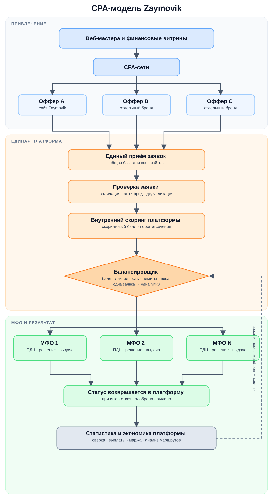

# Zaymovik: основная бизнес-модель

Дата: 1 сентября 2026 года
Статус: базовая концепция

## 1. Суть модели

> **Главное:** Zaymovik не выдаёт деньги и не принимает кредитное решение. Платформа привлекает пользователей, собирает заявки и направляет каждую заявку одному подходящему партнёру-кредитору.

### Участники модели

- **CPA-сеть** — площадка, которая связывает рекламодателя с поставщиками трафика. CPA расшифровывается как Cost per Action — оплата за согласованное целевое действие, например за принятую заявку или выдачу займа.
- **Оффер** — карточка партнёрской программы: отдельный сайт или бренд, условия привлечения, ставка вознаграждения и правила зачёта целевого действия.
- **Веб-мастер или финансовая витрина** — поставщик трафика, который размещает оффер и направляет на сайт пользователей.
- **МФО-партнёр, включая МФК** — микрофинансовая организация, которая оценивает клиента, принимает решение, заключает договор и выдаёт деньги. МФК — один из видов МФО.
- **Заявка** — данные, которые пользователь отправил через форму сайта, чтобы получить предложение займа.
- **Скоринг платформы** — предварительная оценка клиента, результатом которой является скоринговый балл, а не кредитное решение.
- **Балансировщик** — внутренний компонент платформы, который после скоринга выбирает одну подходящую МФО для конкретной заявки.

Модель состоит из двух слоёв:

- **снаружи** — несколько самостоятельных сайтов, брендов и CPA-офферов;
- **внутри** — единая база заявок, общие проверки, предварительный скоринг, один балансировщик и несколько подключённых МФО.

```text
Несколько сайтов → несколько CPA-офферов → единый поток заявок
→ проверки и скоринговый балл → балансировщик
→ одна выбранная МФО → решение и выдача
```

**Несколько офферов снаружи работают как один бизнес внутри:** сайты превращают трафик в заявки, единая платформа обрабатывает и распределяет их, а деньги выдаёт выбранная МФО.

## 2. Зачем несколько сайтов

Один сайт обычно выводится в CPA-сеть как один бренд и один оффер. Несколько сайтов позволяют создать несколько отдельных карточек, участвовать в нескольких ротациях — очередях и наборах размещений у поставщиков трафика — и получать трафик от большего числа веб-мастеров.

### Почему большому офферу требуется более высокий EPC

Веб-мастера сравнивают офферы по доходности и направляют больше трафика тем, на которых зарабатывают больше. У одного оффера ограничен объём трафика, доступный при текущей доходности. Чтобы один оффер вырос, например, с 300 тыс. до 1 млн переходов, ему приходится конкурировать за следующий, более дорогой слой трафика.

Для сравнения офферов используется **EPC — Earnings per Click**, средний заработок веб-мастера на один учтённый переход:

```text
EPC = подтверждённая выплата веб-мастеру / количество учтённых кликов
```

В CPA-сети обычно оплачивается не сам клик, а целевое действие. Поэтому EPC — не тариф за клик, а пересчёт всех подтверждённых выплат в среднюю сумму на один переход.

Три самостоятельных оффера могут получить примерно по трети требуемого объёма каждый, не поднимаясь в тот же дорогой диапазон EPC, который нужен одному офферу для выкупа всего миллиона переходов.

> **Рабочая гипотеза проекта:** одному офферу для привлечения около 1 млн переходов нужен EPC не ниже 150 ₽. Портфель, то есть совокупность из трёх отдельных офферов, может суммарно привлечь тот же объём: примерно по 333 тыс. переходов на оффер при EPC около 90 ₽.

### Иллюстративный расчёт на 1 млн переходов

Расчёт основан на внутренних наблюдениях `150 ₽ против 90 ₽` и показывает эквивалентную сумму выплат веб-мастерам. Это рабочая оценка, а не универсальное правило CPA-рынка.

| Сценарий | Распределение переходов | EPC | Эквивалентная выплата веб-мастерам |
|---|---:|---:|---:|
| Один домен | 1 оффер × 1 000 000 | 150 ₽ | 150 млн ₽ |
| Три домена | 3 оффера × ~333 333 | около 90 ₽ | около 90 млн ₽ |

```text
Один оффер: 1 000 000 × 150 ₽ = 150 млн ₽
Три оффера: 3 × 333 333 × 90 ₽ ≈ 90 млн ₽

Разница эквивалентных выплат: 150 млн ₽ − 90 млн ₽ = 60 млн ₽
Снижение: 60 млн ₽ / 150 млн ₽ = 40%
```

> **Результат расчёта:** при заданных предпосылках эквивалентные выплаты веб-мастерам у портфеля из трёх офферов ниже примерно на 60 млн ₽, или на 40%. Фактическая экономия платформы определяется по счетам CPA-сети с учётом её комиссий и условий.

Если CPA-сеть добавляет к выплатам одинаковую процентную комиссию, абсолютные расходы платформы будут выше, но относительная разница останется 40%. При разных ставках и комиссиях расчёт нужно повторить по фактическим счетам сети.

```text
Чистый эффект портфеля
= снижение счетов CPA-сети
− расходы на запуск и поддержку дополнительных сайтов
− дополнительные потери из-за фрода и отмен
− потери от пересечения одного и того же трафика
```

> **Ключевое условие:** экономию создают не домены сами по себе. Она возникает только тогда, когда каждый оффер получает отдельную карточку, собственную ротацию и добавочный трафик, а не перетягивает тех же пользователей у другого сайта.

## 3. Как движется и распределяется заявка

1. Пользователь видит оффер у веб-мастера или на финансовой витрине, переходит на один из сайтов и заполняет форму.
2. Платформа сохраняет источник перехода, сайт и оффер. Это позволяет понять, откуда пришла заявка и кому должно быть начислено вознаграждение.
3. Заявка проходит технические проверки:
   - **валидация** — проверка заполнения и формата данных;
   - **антифрод** — поиск ботов, поддельных данных и других признаков недобросовестной заявки;
   - **дедупликация** — поиск повторной заявки того же человека, в том числе пришедшей с другого сайта платформы.
4. После технических проверок платформа выполняет предварительный **скоринг** — модель оценивает клиента и присваивает ему скоринговый балл. Этот балл ещё не является кредитным решением: он нужен для отбора и маршрутизации заявок.
5. Для скорингового балла устанавливается **порог отсечения**. Заявки ниже порога не направляются в МФО. Повышение порога сокращает поток, но обычно увеличивает процент одобрений; снижение порога расширяет поток, но обычно уменьшает процент одобрений.
6. Прошедшая порог заявка вместе со скоринговым баллом поступает в балансировщик. Одновременно балансировщик получает данные о пуле доступных МФО: партнёр должен быть активен, его интеграция должна работать, лимит заявок не должен быть исчерпан, а **ликвидность** — возможность выдавать деньги сейчас — должна быть доступна.
7. Если доступно несколько МФО, балансировщик применяет заранее заданные **веса**. Например, веса 50/50 означают, что каждая из двух МФО должна получить примерно половину подходящих заявок.
8. Платформа выбирает одну МФО и направляет активную заявку только ей.
9. Выбранная МФО рассчитывает официальный **ПДН**, показатель долговой нагрузки клиента, принимает финальное кредитное решение и при одобрении выдаёт деньги. ПДН показывает, какая доля среднемесячного дохода клиента будет уходить на платежи по всем кредитам и займам с учётом нового займа.
10. МФО возвращает статус: заявка принята, отказана, одобрена или займ выдан. Эти статусы используются для взаиморасчётов и анализа качества маршрутизации.
11. Передача следующей МФО возможна только по заранее согласованному сценарию, например при технической недоступности первого партнёра. Обычный кредитный отказ сам по себе не означает автоматическую рассылку заявки дальше.

> **Три жёстких правила:** скоринговый балл платформы не является кредитным решением; одна активная заявка одновременно направляется только в одну МФО; официальный ПДН, финальное кредитное решение и выдача всегда остаются на стороне МФО.

## 4. Общая схема



## 5. Подключение партнёрской МФО

Партнёр предоставляет ликвидность и владеет долей в отдельной МФО. Zaymovik организует регистрацию юридического лица, подключает МФО к общей платформе и обеспечивает привлечение заявок и операционную инфраструктуру.

В балансировщике партнёрской МФО назначается целевая доля подходящих заявок. Фактический объём зависит от доступной ликвидности, лимитов и параметров продукта. Если ликвидность заканчивается, поток автоматически перераспределяется между остальными активными МФО.

## 6. Как платформа зарабатывает

Платформа находится между двумя расчётными событиями:

- платформа платит CPA-сети за подтверждённое событие по условиям оффера;
- МФО платит платформе за событие, закреплённое в партнёрском договоре.

**Целевое действие** — конкретное подтверждённое событие: валидная заявка, принятая заявка, одобрение или выдача. Событие оплаты CPA-сети и событие оплаты от МФО могут различаться.

```text
Расходы на CPA = количество действий, оплаченных CPA-сети × ставка сети

Доход от МФО = количество действий, оплаченных МФО × ставка партнёра

Маржа портфеля
= доход от всех МФО
− расходы на все CPA-офферы
− комиссии, фрод, отмены и возвраты
− технические и операционные расходы
− расходы на дополнительные сайты
```

Если CPA-сеть получает оплату за заявку, а МФО платит только за выдачу, платформа берёт на себя риск всей промежуточной конверсии. Поэтому для управления экономикой нужны статусы от первого клика до подтверждённой выдачи.

> **Главная бизнес-метрика — подтверждённая маржа всего портфеля, а не EPC или объём отдельного сайта сами по себе.** Для сравнения офферов дополнительно считаются расходы на 1 000 уникальных переходов, стоимость уникальной заявки и стоимость выданного займа.
