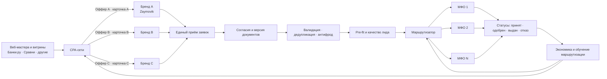
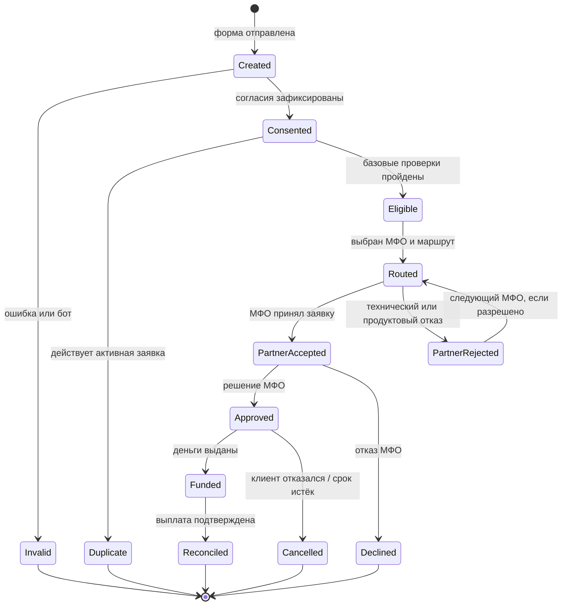

# Zaymovik: мультибрендовая платформа привлечения и маршрутизации заявок

Дата: 1 сентября 2026 года
Статус: рабочая концепция для обсуждения с партнёрами, разработчиками и юристом

> Это не юридическое заключение и не финансовая рекомендация потребителю. Перед запуском формы заявки, рекламы и передачи данных конкретным МФО нужны проверка профильного российского юриста и согласование схемы с каждой площадкой и партнёром.

## 1. Короткий вывод

Рабочая модель — не просто «несколько сайтов с одной формой», а **портфель брендовых офферов в CPA-сетях поверх одной технологической платформы**.

- Каждый сайт позволяет завести отдельный оффер и получить дополнительную карточку/место у веб-мастеров и финансовых витрин, работающих через CPA-сети.
- Единая платформа хранит доказательства согласий, очищает и дедуплицирует заявки, оценивает качество лида и выбирает подходящего партнёра.
- МФО проводит идентификацию, получает необходимые сведения из БКИ, рассчитывает официальный ПДН, принимает кредитное решение, заключает договор и выдаёт деньги.
- Экономический актив бизнеса — не домены сами по себе, а совокупность дистрибуции, обратной связи от МФО, точной маршрутизации и накопленной статистики.

С учётом текущего опыта проекта гипотеза про несколько сайтов имеет две составляющие с разным приоритетом:

1. **Основной эффект — CPA-полка.** Три сайта позволяют завести три оффера и получить до трёх карточек вместо одной. Это текущая причина строить портфель брендов.
2. **Вторичный будущий эффект — контекст.** Несколько брендов могут дать более дешёвый совокупный объём кликов при частично независимых аудиториях и кривых закупки, но по опыту проекта эффективно осваиваемый контекст — около 15% бюджета. На нём не надо основывать решение о запуске портфеля.

Поэтому предварительная рекомендация: **одна компания и одна платформа, несколько устойчивых брендов/доменов, отдельный CPA-оффер на каждый бренд, единая база и последовательная передача заявки одному МФО за раз**. Сайты могут работать с одним широким спросом и пересекающимся пулом МФО: разная сегментация не является обязательным условием, если отдельные офферы реально дают дополнительные карточки и трафик.

### Принятая структура каналов

| Горизонт | Канал | Роль в модели |
|---|---|---|
| Сейчас | CPA-сети — практически 100% привлечения | Главный источник масштаба; несколько сайтов нужны для нескольких офферов и карточек |
| В будущем | Контекст — ориентировочно до 15% эффективного бюджета | Дополнительный управляемый источник, ретест брендов и закрытие части high-intent спроса |
| Позже, отдельно | SEO и другие каналы | Опциональный прирост; не являются основанием текущей бизнес-модели |

Ниже термин «МФО» используется как общее обозначение партнёров-МФК и МКК.

## 2. Что именно строится



Пользователь видит понятный путь: «оставить одну заявку → получить подходящее предложение конкретного МФО». Он не должен ошибочно считать, что Zaymovik сам выдаёт деньги или гарантирует одобрение.

Текущий денежный поток:

```text
МФО платит платформе за согласованное целевое действие
→ платформа оплачивает CPA-сети действие по своему офферу
→ CPA-сеть рассчитывается с веб-мастером/витриной
→ разница после переменных затрат, холда и chargeback остаётся платформе
```

Критически важно приблизить оплачиваемое CPA-сети событие к событию, за которое платит МФО. Если сеть получает деньги за валидный лид, а МФО платит только за `funded`, весь риск конверсии между этими статусами остаётся на платформе и должен быть заложен в цену.

## 3. Роли и границы ответственности

| Участник | Делает | Не делает |
|---|---|---|
| Компания-платформа | Владеет брендами, покупает трафик, собирает заявку и согласия, проверяет заполнение, борется с дублями и ботами, выбирает маршрут, ведёт атрибуцию и расчёты с партнёрами | Не выдаёт деньги, не заключает договор займа, не обещает одобрение |
| Бренд-сайт | Даёт отдельное позиционирование, контент, карточку/оффер и воронку под сегмент | Не создаёт отдельную бесконтрольную копию базы и правил маршрутизации |
| МФО-партнёр | Проводит обязательные проверки, рассчитывает ПДН, принимает решение, раскрывает индивидуальные условия, подписывает договор, выдаёт деньги | Не получает заявку без предусмотренного согласия и основания |
| CPA-сеть | Подключает отдельные офферы, ведёт атрибуцию и рассчитывается с веб-мастерами | Не отвечает за внутреннюю дедупликацию клиента между офферами платформы |
| Веб-мастер или витрина | Размещает карточки офферов и поставляет трафик | Не определяет конечного МФО и не должен описывать посредника как кредитора |
| Рекламная система | В будущем закупает до примерно 15% бюджета по результатам аукциона | Не является основным каналом текущей модели и не обязана считать разные домены независимыми рекламодателями |

Банк России ведёт государственный реестр МФО; выдавать микрозаймы должен именно участник соответствующего регулируемого рынка. Платформа перед подключением и затем регулярно проверяет наличие партнёра в реестре и отсутствие ограничений деятельности.

## 4. Почему портфель сайтов может дать больше трафика

### 4.1. CPA-сети: основная модель дистрибуции

Принятое исходное условие: каждый новый сайт позволяет завести отдельный оффер в CPA-сети, а веб-мастера и витрины могут разместить отдельную карточку этого оффера. Поэтому три сайта дают портфелю до трёх карточек и несколько точек входа. Это может дать:

- несколько карточек вместо одной;
- разные заголовки, позиционирование и посадочные;
- отдельные рейтинги конверсии офферов;
- отдельные лимиты, источники и веб-мастеров;
- больше шансов попасть в ротацию и подборки;
- снижение зависимости от просадки одного бренда;
- возможность удержать несколько мест на одной витрине и большую долю категории.

В этой модели бренды не обязаны обслуживать совершенно разные сегменты. Они могут решать одну широкую задачу и использовать пересекающийся пул МФО. Однако у каждого бренда должны быть стабильные домен, название, креативы, посадочная, offer ID, статистика и юридически корректные раскрытия. Это позволяет управлять ими как портфелем, а не как случайными дублями.

Для каждой CPA-сети надо зафиксировать операционные правила:

1. Сколько офферов одного владельца сеть допускает в категории?
2. Какие витрины и веб-мастера могут одновременно показывать эти офферы?
3. Какое событие оплачивается: лид, принятая заявка, одобрение или выдача?
4. Как работают cookie window, last click и пересечение click ID?
5. Кто несёт стоимость одного клиента, пришедшего последовательно через два бренда?
6. Какие правила площадки применяют к дублям, фроду и chargeback?
7. Можно ли использовать один пул МФО и одну технологическую платформу для нескольких офферов?
8. Какие раскрытия роли посредника должны быть в карточке и на посадочной?

Ключевая защита экономики — глобальная межбрендовая дедупликация. Один человек, пришедший через три карточки, не должен превращаться в три оплаченных лида и три параллельные передачи МФО. Система сохраняет все касания для атрибуции, но создаёт одну активную заявку и применяет заранее согласованное правило оплаты источника.

### 4.2. Контекстная реклама: будущие примерно 15% бюджета

Контекст — дополнительный, а не основной довод в пользу нескольких сайтов. По опыту проекта эффективно можно закупать около 15% совокупного бюджета; остальные объёмы на текущем этапе предполагается получать через CPA-сети.

Идею можно описать математически. Пусть `Cᵢ(qᵢ)` — стоимость покупки `qᵢ` кликов для бренда `i`. Тогда минимальная стоимость миллиона кликов портфелем:

```text
Cportfolio(Q) = min Σ Cᵢ(qᵢ), при условии Σ qᵢ = Q
```

Портфель будет дешевле одного сайта, когда кривые `Cᵢ` хотя бы частично независимы. Например:

- разные бренды имеют разные поисковые кластеры и релевантные страницы;
- различаются аудитории, креативы, ретаргетинг и частотные ограничения;
- площадка выделяет независимые лимиты или ротацию офферам;
- один бренд лучше конвертит дорогой high-intent, другой — более широкий mid-intent;
- разные бренды получают разный коэффициент качества.

Экономии может не быть, когда домены фактически одинаковы:

- запросы, регион, услуги и поставщик совпадают;
- объявления конкурируют за одну аудиторию;
- рекламная система дедуплицирует связанные объявления;
- статистика размазывается, и каждому бренду не хватает данных для оптимизации;
- новые домены имеют более слабое доверие и конверсию.

Для Яндекс Директа это не теоретический риск: в официальной справке указано, что при сходных сайтах и совпадающих предложениях в одном регионе из нескольких объявлений показывается одно — с лучшей комбинацией CTR, ставки и качества. Поэтому на поиске Яндекса три клона не равны трём независимым местам.

Правильная формулировка будущей гипотезы:

> Несколько брендов позволяют дешевле купить большой совокупный объём не потому, что у них разные домены, а потому, что они открывают частично независимые кривые предложения трафика и лучше соответствуют разным интентам.

### 4.3. SEO: опционально, вне ядра текущей модели

Для текущего решения SEO можно не учитывать. Если канал появится позже, несколько сайтов оправданы, когда у каждого есть собственный информационный и продуктовый контур. Копии создают расходы на ссылки, контент, техническое качество и доверие, а также могут конкурировать друг с другом по одним запросам.

Разумное разделение трёх брендов:

| Бренд | Основной интент | Отличие продукта и контента |
|---|---|---|
| A: Zaymovik | Широкий спрос «получить займ» | Главный бренд, максимальный пул партнёров |
| B: отдельный сегмент | Например, небольшая сумма и короткий срок | Свой набор запросов, калькуляторы, объяснение полной стоимости и рисков |
| C: отдельный сценарий | Например, более длинный срок или повторный клиент, если это поддерживают партнёры | Другой партнёрский пул, условия, контент и воронка |

Сегментация должна отражать реальные различия. Нельзя обещать «без отказа», «гарантированную выдачу» или создавать ложное впечатление, что сайт является МФО.

## 5. Как определить, что новый сайт действительно добавляет объём

Для каждого нового бренда считаются не только его собственные клики и действия, но и добавочный эффект всего CPA-портфеля.

```text
Добавочные уникальные клики = уникальные клики портфеля после запуска −
                              ожидаемые уникальные клики без нового бренда

Каннибализация = 1 − добавочные уникальные клики / все клики нового бренда

Добавочная маржа = маржа портфеля после запуска − маржа базового сценария −
                   дополнительный постоянный расход на бренд
```

Новый бренд масштабируется, если одновременно выполняются условия:

- добавочная маржа положительная на подтверждённом окне атрибуции;
- доля дублей и каннибализация укладываются в установленный предел;
- качество, жалобы и отказы не ухудшаются;
- партнёры принимают такой источник и оплачивают выдачи;
- площадки считают бренд самостоятельным оффером;
- юридическая и операционная стоимость бренда окупается.

Дополнительно для CPA считаются:

```text
Стоимость действия сети = все начисления CPA-сети / оплаченные сетью действия

Чистый спред выдачи = payout МФО − эффективная стоимость CPA-привлечения выдачи
                      − переменные затраты − ожидаемый chargeback

Доля полки = число одновременно размещённых карточек наших офферов /
             число доступных карточек категории на выбранной витрине
```

Лучший тест — не сравнение трёх офферов между собой, а изменение совокупной маржи и объёма портфеля. При возможности часть сопоставимых витрин, веб-мастеров или периода остаётся с одним оффером, другая получает три. Сравнивается подтверждённая маржа на тысячу уникальных кликов и на одну выдачу после глобальной дедупликации.

## 6. Пользовательский путь и статусы заявки



Ключевой принцип: **не отправлять одну заявку одновременно всем партнёрам по умолчанию**. Последовательный waterfall уменьшает число ненужных передач персональных данных, дублей, обращений и возможных запросов в БКИ. Переход к следующему партнёру допустим только при понятном согласии пользователя, правилах партнёров и зафиксированной причине предыдущего отказа/таймаута.

## 7. Скоринг: что должна и чего не должна решать платформа

В системе нужны два разных понятия.

### 7.1. Pre-fit платформы

Это не решение о выдаче и не официальный ПДН. Pre-fit может учитывать:

- соответствие возрасту, географии, сумме и сроку конкретного продукта;
- полноту и техническую валидность анкеты;
- подтверждение телефона;
- наличие активного дубля или периода ожидания;
- признаки бота, накрутки и технического мошенничества;
- источник, кампанию и историческое качество такого трафика;
- добровольно предоставленные пользователем сведения, если для них есть понятная цель и основание;
- предыдущие обезличенные статусы маршрутов.

Чувствительные данные, скрытые прокси дискриминации и сведения, не нужные для маршрутизации, использовать не следует. Device- и поведенческие признаки разумно применять для антифрода, а не для имитации кредитного решения.

### 7.2. Решение МФО

Официальный ПДН рассчитывает кредитная организация или МФО при принятии решения о займе. Получение основной части кредитной истории требует надлежащего согласия с указанием пользователя кредитной истории. Поэтому безопасная исходная архитектура такова:

- платформа не запрашивает кредитный отчёт для собственного центрального скоринга;
- после выбора и согласия пользователя это делает конкретное МФО;
- МФО рассчитывает ПДН по своей утверждённой методике;
- платформа получает минимально необходимый результат: принят, отказ, одобрен, выдан и нормализованный reason code, если договор это позволяет.

В интерфейсах и документации показатель платформы следует называть `pre-fit`, `вероятность подходящего маршрута` или `качество лида`, но не «ПДН клиента» и не «решение по займу».

## 8. Логика маршрутизатора

### 8.1. Сначала жёсткие ограничения

Для каждого партнёра проверяются:

- активность в реестре и внутренний статус допуска;
- продукт, возраст, география, сумма, срок;
- рабочее время, дневной/часовой cap;
- разрешённый источник и бренд;
- наличие согласия на передачу именно этому получателю;
- дубли и cooldown партнёра;
- техническая доступность API;
- ограничения договора и списки исключения.

### 8.2. Затем ожидаемая ценность маршрута

Для прошедших фильтр партнёров можно считать:

```text
EV(lead, partner) = P(funded | lead, partner) × net_payout(partner)
                    − variable_cost(partner)
                    − quality_and_compliance_penalty
```

Где `net_payout` уже учитывает холд, отмены и chargeback. Сначала соблюдаются интерес пользователя, продуктовая совместимость и обязательные ограничения; только среди допустимых вариантов оптимизируются вероятность выдачи и маржа.

### 8.3. Практический алгоритм

1. Отфильтровать недопустимых партнёров.
2. Исключить уже использованные маршруты и активные дубли.
3. Рассчитать вероятность статуса `funded` по каждому допустимому партнёру.
4. Рассчитать ожидаемую чистую ценность.
5. Зарезервировать один маршрут атомарно, чтобы заявку нельзя было одновременно отправить дважды.
6. Отправить заявку и дождаться синхронного ответа или оговорённого таймаута.
7. При техническом отказе применить безопасный retry; при продуктовом отказе — следующий допустимый маршрут, если это покрыто согласием.
8. Получить postback до `funded/reconciled` и обновить статистику.

Часть трафика можно оставлять на контролируемое исследование новых партнёров, иначе алгоритм навсегда закрепит раннего победителя. Доля исследования задаётся бизнесом и снижается при недостатке cap, ухудшении качества или жалобах.

## 9. База данных и события

Единая база не должна быть одной большой таблицей с полными анкетами. Минимальная модель:

| Сущность | Назначение |
|---|---|
| `brand` | Бренд, домен, юридические раскрытия, версия воронки |
| `traffic_source` / `campaign` | Площадка, offer ID, click ID, UTM, стоимость |
| `visitor` | Псевдонимный идентификатор для сквозной дедупликации |
| `consent` | Текст/версия, цель, получатели, время, способ подтверждения и доказательства |
| `lead` | Нормализованная заявка и текущий статус |
| `pii_vault` | Отдельно защищённые идентифицирующие данные |
| `partner` / `partner_offer` | Реестровые данные, продуктовые правила, cap, ставка, SLA |
| `routing_decision` | Кандидаты, причины исключения, выбранный партнёр, версия модели |
| `partner_attempt` | Уникальный запрос, время, ответ, reason code, retry |
| `status_event` | Неизменяемая история изменения статусов |
| `payout` | Начисление, холд, подтверждение, отмена, сверка |
| `suppression` | Отзыв согласия, запрет коммуникации, cooldown, технический блок |
| `audit_log` | Доступы, выгрузки и административные действия |

Обязательные технические свойства:

- `idempotency key` на каждую заявку и попытку передачи;
- шифрование при передаче и хранении;
- раздельный доступ к PII и аналитике;
- неизменяемый журнал согласий и маршрутов;
- автоматические сроки удаления и блокировки;
- ограничение массовых выгрузок;
- мониторинг аномальных доступов;
- резервирование cap и circuit breaker при сбоях партнёра;
- сверка входящих postback с исходной попыткой и подписью партнёра.

## 10. Согласия и персональные данные

Мультибрендовая схема делает доказуемое согласие одной из центральных частей продукта.

Минимальный безопасный дизайн:

1. На каждом сайте явно указан оператор персональных данных и его реквизиты.
2. Согласие на обработку персональных данных оформляется отдельно от других подтверждаемых документов; checkbox не проставлен заранее.
3. Цели разделены: обработка заявки, передача выбранному партнёру, рекламные звонки/SMS/email — не одна универсальная галочка.
4. До передачи пользователь понимает, кому именно передаются данные. Консервативный вариант — показать юридическое наименование конкретного МФО и получить подтверждение перед отправкой. Модель с перечнем потенциальных партнёров должна быть отдельно одобрена юристом.
5. Для каждого согласия сохраняются версия текста, дата и время, бренд, страница, идентификатор сессии, техническое доказательство действия и перечень получателей/целей.
6. Отзыв согласия синхронизируется с suppression-списком и затрагивает процессоров/получателей в той мере, в которой этого требует закон и договор.
7. Маркетинговые коммуникации не являются обязательным условием отправки заявки.
8. На каждом домене опубликована доступная политика обработки персональных данных.
9. Компания проверяет обязанность уведомления Роскомнадзора до начала обработки и поддерживает сведения об операторе в актуальном состоянии.
10. Сбор, запись, систематизация, накопление, хранение, уточнение и извлечение данных граждан РФ строятся с учётом требований локализации российских баз.

В договорах с МФО нужно однозначно определить, кто является самостоятельным оператором, а кто обрабатывает данные по поручению, для каких целей, какие поля передаются, как обрабатываются отзывы и инциденты и когда данные уничтожаются. При мультипартнёрской маршрутизации компания-платформа, вероятнее всего, сама определяет существенную часть целей и способов обработки; считать её просто «техническим транзитом» без отдельного анализа рискованно.

## 11. Реклама, интерфейс и потребительская прозрачность

На каждом бренде заметно, до формы и рядом с ключевым действием, раскрывается:

- юридическое лицо — владелец сервиса;
- «сервис не является кредитором/МФО, не выдаёт деньги и не принимает решение о займе»;
- выдачу осуществляет конкретное МФО после собственной проверки;
- подача заявки не гарантирует одобрение;
- платный или бесплатный характер сервиса для пользователя;
- параметры и фактический поставщик каждого рекламируемого финансового продукта;
- актуальная ссылка на реестр Банка России или данные реестровой записи партнёра;
- порядок обращения, отзыва согласия и прекращения рекламных коммуникаций.

Для рекламы финансовых услуг действующая статья 28 Закона о рекламе, в частности, требует указывать лицо, оказывающее услугу. Реклама услуг, связанных с потребительским кредитом/займом, должна содержать предупреждение **«Оценивайте свои финансовые возможности и риски»**. Если сообщается процентная ставка, появляются дополнительные требования к диапазону полной стоимости займа и порядку его показа. Это должно быть проверено по каждому формату, креативу, карточке и посадочной странице.

Интернет-реклама также требует учёта правил маркировки, указания рекламодателя, получения идентификатора рекламы и передачи сведений через оператора рекламных данных там, где соответствующие требования применяются.

Нельзя строить конверсию на:

- обещании «100% одобрения» или «без отказа»;
- маскировке посредника под МФО;
- скрытой платной подписке на подбор или рекуррентном списании;
- заранее включённых дополнительных услугах;
- массовой одновременной отправке анкеты без понятного выбора и согласия;
- сокрытии существенных условий или юридического лица кредитора;
- давлении на пользователя с целью немедленно взять займ.

Отдельно надо учитывать партнёрские статусы. С 1 марта 2025 года действует механизм самозапрета на потребительские кредиты и займы, который проверяет кредитор. С 1 сентября 2025 года для ряда сумм действует период охлаждения. Это означает, что `approved` и `funded` могут заметно расходиться по времени, а окончательное вознаграждение нельзя считать по одному лишь одобрению.

## 12. Монетизация и unit economics

На входе и выходе платформы находятся два разных коммерческих события:

- CPA-сеть выставляет платформе стоимость действия по офферу;
- МФО платит платформе за действие по партнёрскому договору.

Их статусы и окна атрибуции должны быть максимально согласованы. Возможные договорные модели с МФО и CPA-сетью:

| Модель | Плюс | Риск |
|---|---|---|
| CPL за валидную/принятую заявку | Быстрый денежный цикл | Споры о качестве и стимул гнать объём вместо выдач |
| CPA за `funded` | Интересы платформы и МФО лучше совпадают | Длиннее атрибуция, сильная зависимость от postback и внутренних решений МФО |
| Гибрид: базовая ставка + бонус за `funded` | Покрывает часть проверки и сохраняет мотивацию к качеству | Сложнее договор и сверка |
| Revenue share | Потенциально выше LTV | Больше регуляторных, данных и расчётных вопросов; не нужен на первом этапе |

Базовый вариант для модели — получать от МФО и платить CPA-сети по подтверждённой выдаче либо заранее закладывать в ставку сети риск перехода от оплачиваемого лида к `funded`. Сервис для пользователя остаётся бесплатным, если не принято отдельное и юридически проверенное решение.

### 12.1. Экономика одного лида

```text
Expected revenue per lead = Σ P(route to partner i) ×
                                P(funded | lead, partner i) ×
                                net payout i

Contribution per lead = expected revenue per lead
                        − validation and communication cost
                        − variable infrastructure cost
                        − expected chargeback/fraud loss
```

### 12.2. Экономика одного клика

```text
Revenue per click = click-to-valid-lead conversion × expected revenue per valid lead

Contribution per click = revenue per click − CPC − variable cost per click

Break-even CPC = click-to-valid-lead conversion ×
                 contribution before acquisition per valid lead
```

Для текущего CPA-канала прямого CPC может не быть. Тогда вместо него используется эффективная стоимость клика или выдачи:

```text
Effective CPC = все начисления CPA-сети / все уникальные клики

Effective CPA funded = все начисления CPA-сети / подтверждённые выдачи МФО
```

### 12.3. Экономика портфеля

Главный показатель — не средний CPC и не число заявок, а:

```text
Portfolio contribution = confirmed partner revenue
                         − media spend
                         − CPA/network commissions
                         − verification and communication
                         − variable infrastructure
                         − chargebacks and fraud
                         − incremental brand operating cost
```

Миллион кликов через портфель CPA-офферов имеет смысл принимать только пока **маржинальный** следующий пакет трафика остаётся прибыльным. Главный ограничитель — не CPC сам по себе, а ставка сети за действие, итоговый `funded rate`, payout МФО, дубли и chargeback. Контекст позже анализируется отдельно в пределах его ориентировочной 15%-ной доли бюджета.

## 13. Метрики

### Привлечение через CPA

- уникальные клики, offer ID, сеть, веб-мастер/sub ID и карточка;
- ставка CPA-сети и эффективный CPC/CPA;
- click → lead;
- доля валидных лидов;
- доля межбрендовых дублей;
- стоимость валидного лида;
- добавочные клики, карточки и маржа нового оффера;
- доля полки и объём на одну карточку;
- каннибализация между собственными офферами.

### Маршрутизация

- доля лидов, для которых найден допустимый партнёр;
- время до первого ответа;
- технические и продуктовые отказы отдельно;
- доля waterfall, дошедшая до второго/третьего партнёра;
- вероятность `funded` по связке сегмент × партнёр;
- незакрытые и потерянные статусы postback;
- cap saturation и время недоступности партнёра.

### Экономика

- revenue per click, revenue per valid lead;
- payout по `funded`, а не по предварительному `approved`;
- contribution per click/lead/выдачу;
- срок холда и денежный цикл;
- доля chargeback;
- добавочная маржа каждого бренда и площадки.

### Качество и доверие

- жалобы на бренд, источник и партнёра;
- отписки и требования прекратить обработку;
- доля ошибочных/неожиданных звонков;
- число передач одной заявки;
- инциденты персональных данных;
- доля креативов и страниц, прошедших compliance review.

Рекомендуемая north-star метрика: **подтверждённая contribution margin на 1 000 уникальных кликов портфеля**, при ограничениях по жалобам, числу передач и качеству.

## 14. Партнёрский договор и API

До подключения МФО согласуются:

- юридический статус и актуальная запись в реестре;
- допустимые бренды и источники трафика;
- продуктовые фильтры и cap;
- точный состав передаваемых данных;
- основание и модель обработки персональных данных;
- допустимость повторной маршрутизации;
- единая таксономия статусов и reason codes;
- момент, когда возникает право на выплату;
- окно атрибуции, холд, chargeback и сверка;
- SLA синхронного ответа и postback;
- правила retry и idempotency;
- уведомление об изменении продукта, ставки, реестрового статуса и ограничений;
- работа с жалобами, отзывом согласия и инцидентами;
- право аудита источников и запрет субпередачи без согласования.

Минимальная таксономия событий:

```text
received
invalid
duplicate
ineligible
accepted
declined
approved
signed
funded
cancelled
payout_confirmed
payout_reversed
```

Для аналитики достаточно нормализованной причины отказа. Полные данные кредитной истории и подробности возврата займа не следует собирать «на всякий случай».

## 15. Порядок запуска

### Этап 0. Описать действующие CPA-правила

- Собрать по текущим CPA-сетям правила регистрации нескольких офферов и фактические места размещения.
- Зафиксировать, какие веб-мастера/витрины дают отдельную карточку каждому офферу.
- Собрать фактические ставки сети, целевые действия, холды, dedup-правила, chargeback и sub ID.
- Определить единое правило, кто получает атрибуцию и оплату при межбрендовом дубле.

**Результат:** таблица `CPA-сеть × оффер × карточка/веб-мастер × целевое действие × ставка × dedup × экономика`.

### Этап 1. Сделать ядро на Zaymovik

- Привести раскрытия, согласия и партнёрские договоры к одной модели.
- Ввести единые статусы и обязательные postback до `funded`.
- Запустить дедупликацию, consent ledger и расчёт contribution.
- Перевести партнёров на последовательную маршрутизацию.

**Результат:** по каждому клику видно источник, заявку, маршрут, выдачу и подтверждённую маржу.

### Этап 2. Запустить второй бренд как эксперимент

- Создать устойчивый отдельный бренд и домен с корректным раскрытием роли посредника.
- Дать бренду отдельный offer ID, карточку и экономику, но общее технологическое ядро.
- Подключить его в тех же и/или дополнительных CPA-сетях.
- Измерить добавочные карточки, уникальные клики, дубли, `funded` и маржу портфеля.

**Gate:** второй бренд масштабируется, если отдельный оффер реально получает добавочное размещение и положительную добавочную маржу. Отдельный поисковый сегмент на этом этапе не обязателен.

### Этап 3. Запустить третий бренд

Повторить процесс для ещё одного оффера. В текущей CPA-модели достаточным обоснованием третьего сайта может быть отдельная карточка и добавочный поток веб-мастеров, даже если аудитория и пул МФО пересекаются с первыми двумя брендами.

### Этап 4. Улучшать маршрутизацию

- Калибровать вероятность `funded` по партнёру и сегменту.
- Автоматически учитывать cap, сбои, холд и chargeback.
- Оставлять контролируемую долю исследования новым партнёрам.
- Оценивать изменения по совокупной портфельной марже, а не по локальному CR сайта.

### Этап 5. Добавить контекст как вспомогательный канал

- Не включать контекст в обоснование первых CPA-брендов.
- Выделить ему до примерно 15% бюджета, пока фактическая маржинальность подтверждает этот предел.
- Разделять семантику и аудитории брендов, чтобы не опираться на занятие нескольких мест сходными сайтами.
- Сравнивать его с CPA по одинаковому конечному событию `funded` и contribution margin.

## 16. Главные риски и защита

| Риск | Что произойдёт | Защита |
|---|---|---|
| Один клиент проходит через несколько офферов | Несколько начислений CPA-сети за одну экономическую заявку | Глобальный dedup, единое правило атрибуции и не более одной активной заявки |
| Новый оффер существует только в кабинете | Offer ID есть, но карточка не даёт добавочного трафика | Считать фактические размещения, клики и добавочную маржу |
| Событие сети раньше события оплаты МФО | Платформа оплачивает лиды, которые не превращаются в выданные займы | Согласовать события или заложить funded rate и риск в ставку |
| Яндекс признает сайты сходными | В поиске будет показано одно объявление | Разные сегменты, семантика и продукт; не считать клоны способом занять несколько мест |
| Межбрендовая каннибализация | Красивые локальные отчёты без прироста бизнеса | Сквозной visitor ID, holdout и портфельная экономика |
| Одновременная отправка многим МФО | Жалобы, лишние передачи, дубли и плохой антифрод-сигнал | Последовательный waterfall и лимит попыток |
| Платформа изображает кредитора | Мисселинг и рекламные/регуляторные риски | Ясное раскрытие роли и конкретного МФО |
| Универсальная галочка на всех партнёров и цели | Согласие сложно доказать | Разделённые согласия и журнал версий/получателей |
| Нет `funded` postback | Невозможно управлять реальной экономикой | Статусная модель и договорный SLA до выдачи/сверки |
| Роутер выбирает только максимальный payout | Падает выдача, качество и доверие | Сначала допустимость и fit, затем вероятность выдачи и net margin |
| Утечка единой базы | Системный ущерб всем брендам | PII vault, минимизация, доступы, шифрование, аудит и план реагирования |
| Партнёр исключён из реестра или ограничен | Недопустимая передача и неработающие маршруты | Регулярная проверка реестра и автоматическая остановка |

## 17. Решение, которое выглядит наиболее здравым сейчас

1. Создать **портфель из трёх устойчивых брендов/доменов прежде всего ради трёх CPA-офферов и карточек**.
2. Оставить **одно юридическое и технологическое ядро**, если договорные правила площадок не требуют иного. Не создавать фиктивные отдельные компании только ради дополнительных карточек.
3. Сайты могут работать с одним широким спросом и общим пулом МФО; их текущая функция — дать отдельные офферы и большую долю CPA-полки, а не обязательно разделить поисковые сегменты.
4. Проверять «эффект полки» по факту: три оффера должны реально получать несколько карточек и добавочный трафик, а не только три ID в кабинете.
5. Считать CPA-сети текущим основным каналом. Контекст оставить на будущее как вспомогательный канал примерно до 15% эффективного бюджета.
6. Вести **одну дедуплицированную воронку**, но изолировать PII от аналитики и не допускать двойной оплаты одного пользователя между офферами.
7. Использовать платформенный скоринг для pre-fit и маршрутизации, а официальный ПДН и решение оставить МФО.
8. Передавать заявку **одному партнёру за раз** с прозрачным согласием и ограниченным waterfall.
9. Оптимизировать не локальный объём каждого оффера, а подтверждённую добавочную contribution margin всего портфеля.

## 18. Данные, которые нужны для следующей итерации модели

Чтобы превратить концепцию в финансовый план и ТЗ, надо заполнить:

- список текущих МФО, продукты, требования, caps и часы работы;
- payout, холд, chargeback и окно атрибуции по каждому партнёру;
- фактические статусы, которые партнёры уже возвращают;
- текущие клики, click → lead, valid rate, accepted rate и funded rate Zaymovik по каждой CPA-сети;
- ставка сети, оплачиваемое событие, холд и chargeback каждого текущего оффера;
- список CPA-сетей, веб-мастеров и витрин, где можно получить несколько карточек;
- фактические правила нескольких офферов/карточек в каждой сети;
- правило межбрендовой дедупликации и атрибуции;
- предполагаемые бренды/домены второго и третьего офферов;
- поля текущей анкеты и тексты согласий;
- текущая схема хранения, удаления и передачи данных;
- бесплатен ли сервис для пользователя;
- допустимое число последовательных попыток и cooldown;
- текущий CPA-бюджет, будущий лимит контекста около 15% и минимальная требуемая contribution margin.

## 19. Источники и актуальные ориентиры

- [Банк России: микрофинансирование и реестр МФО](https://www.cbr.ru/microfinance/)
- [Банк России: показатель долговой нагрузки](https://www.cbr.ru/finstab/instruments/pti/)
- [Банк России: разъяснения по расчёту ПДН, редакция 2026 года](https://www.cbr.ru/explan/dfs_pdnz/dfs_pdnz_6579-u_7286-u/)
- [Банк России: согласие на получение кредитной истории](https://www.cbr.ru/Reception/TopicalMessage/Page/3154)
- [Банк России: самозапрет на кредиты и займы](https://www.cbr.ru/ckki/self-prohibition_credit/)
- [Банк России: период охлаждения по кредитам и займам](https://www.cbr.ru/faq/information_security/cooling-off_period/)
- [Закон о рекламе, статья 28: реклама финансовых услуг](https://www.consultant.ru/document/cons_doc_LAW_58968/0021818db8b93ae5fbd38076074a7182e157186c/)
- [Федеральный закон от 26.12.2024 № 479-ФЗ на официальном портале](https://publication.pravo.gov.ru/document/0001202412260005)
- [Закон о рекламе, статья 18.1: интернет-реклама](https://www.consultant.ru/document/cons_doc_LAW_58968/2c4537e4796f6ff8b2736ed1b0d4fef08e14458e/)
- [152-ФЗ, статья 9: согласие субъекта персональных данных](https://www.consultant.ru/document/cons_doc_LAW_61801/6c94959bc017ac80140621762d2ac59f6006b08c/)
- [152-ФЗ, статья 18: обязанности при сборе персональных данных и локализация](https://www.consultant.ru/document/cons_doc_LAW_61801/cbf4e15b7c330f9372e876cdf2bc928bad7950ef/)
- [152-ФЗ, статья 18.1: политика и организационные меры](https://www.consultant.ru/document/cons_doc_LAW_61801/eeeebe22bf738fd65bb66b95cc278911ae2525ee/)
- [152-ФЗ, статья 22: уведомление об обработке персональных данных](https://www.consultant.ru/document/cons_doc_LAW_61801/d996966e22e1320c9de1ab82d9f6be12c3d9d765/)
- [Яндекс Директ: сходные сайты и показ одного объявления](https://www.yandex.ru/support/direct/ru/troubleshooting/clones)
- [Сравни: публичная страница партнёрской программы](https://partner.sravni.ru/)
- [Банки.ру: как финансовый маркетплейс зарабатывает на размещении продуктов](https://www.banki.ru/microloans/about/how-we-make-money/)
