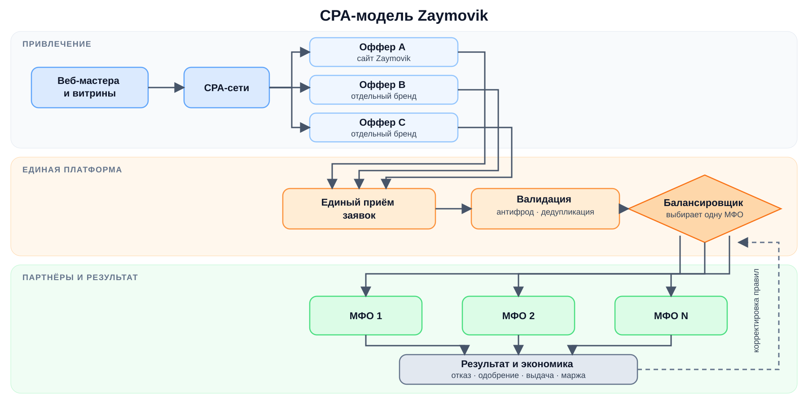

# Zaymovik: основная бизнес-модель

Дата: 1 сентября 2026 года
Статус: базовая концепция

## 1. Суть модели

Zaymovik — не кредитор, а платформа привлечения и распределения заявок между МФО-партнёрами.

Модель строится в два слоя:

- **снаружи** — несколько самостоятельных сайтов и CPA-офферов;
- **внутри** — единая база заявок, общая дедупликация, один балансировщик и несколько МФО.

Главная формула:

```text
Несколько сайтов → несколько CPA-офферов → единый поток заявок
→ балансировщик → одна подходящая МФО → решение и выдача
```

Сайты создают объём и присутствие в CPA-канале. Платформа превращает этот объём в управляемый поток лидов. МФО проводит скоринг, рассчитывает ПДН, принимает кредитное решение и выдаёт деньги.

## 2. Зачем несколько сайтов

Каждый сайт можно вывести в CPA-сеть как отдельный бренд и отдельный оффер. Это даёт несколько карточек и больше мест в ротациях у веб-мастеров и финансовых витрин.

Ключевой показатель для получения объёма в CPA-сети — **EPC**, то есть заработок веб-мастера на один отправленный клик. Чем больше трафика должен выкупить один оффер, тем выше должен быть его EPC, чтобы веб-мастера отдавали ему больший объём.

По текущему опыту, чтобы один оффер получил около 1 млн кликов, ему нужен EPC порядка 150 ₽ и выше. Если тот же объём распределить между тремя отдельными офферами, каждому достаточно выкупить примерно 333 тыс. кликов при EPC около 90 ₽.

### Экономика на 1 млн кликов

| Сценарий | Распределение трафика | EPC | Затраты на 1 млн кликов |
|---|---:|---:|---:|
| Один домен | 1 оффер × 1 000 000 | 150+ ₽ | от 150 млн ₽ |
| Три домена | 3 оффера × ~333 000 | около 90 ₽ | около 90 млн ₽ |

```text
Экономия = 150 млн ₽ − 90 млн ₽ = 60 млн ₽
Снижение затрат = 60 млн ₽ / 150 млн ₽ = 40%
```

При заданных EPC портфель из трёх офферов покупает тот же миллион кликов примерно на 60 млн ₽, или на 40%, дешевле. Экономию создаёт не сам факт наличия разных доменов, а разделение большого объёма между несколькими самостоятельными карточками и ротациями.

Эта логика работает, если каждый оффер действительно получает добавочное размещение и собственную долю трафика, а не перетягивает одних и тех же пользователей у другого оффера. При этом внутри не создаются три отдельных бизнеса: все сайты используют одну технологическую и партнёрскую инфраструктуру.

Расчёт показывает стоимость трафика на уровне EPC и не включает комиссию CPA-сети, фрод, отмены и операционные расходы.

## 3. Общая схема



## 4. Логика работы

1. Пользователь приходит через CPA-сеть на один из сайтов и оставляет заявку.
2. Платформа сохраняет сайт, оффер и источник трафика.
3. Заявка проходит валидацию, антифрод и проверку на дубли между всеми сайтами.
4. Балансировщик формирует список доступных МФО с учётом их активности, лимитов, ликвидности и базовых параметров продукта.
5. Если подходит несколько МФО, система выбирает одну по заданным весам, например 50/50 или 30/70.
6. Выбранная МФО проводит собственный скоринг и расчёт ПДН, после чего принимает решение.
7. Результат возвращается в платформу и используется для расчётов и настройки распределения.

Ключевое правило: одна активная заявка отправляется в одну МФО, а не веером всем партнёрам. Переход к следующей МФО возможен только по заранее установленному сценарию — например, при технической недоступности первой.

Балансировщик управляет маршрутом и пропорциями заявок, но не заменяет кредитный скоринг МФО.

## 5. Экономика

```text
Доход от МФО за согласованное целевое действие
− выплата CPA-сети
− операционные расходы, фрод и отмены
= маржа платформы
```

Главный показатель модели — положительная маржа всего портфеля на одну уникальную заявку с учётом дублей между сайтами.
